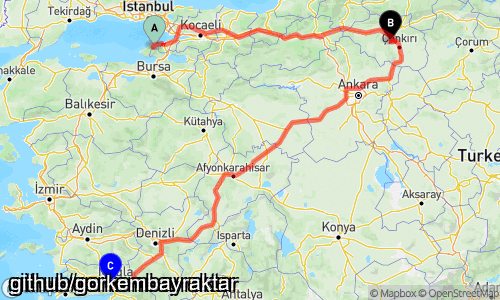
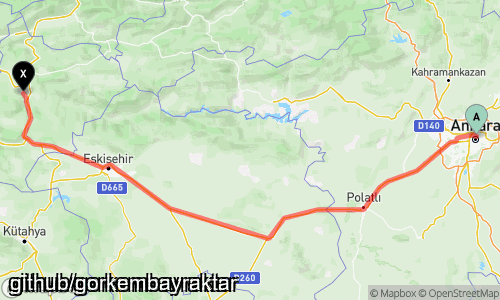

# Lokasyonlar Arası Statik Harita
Bu sınıf lokasyonlar arası statik harita çıktısı almanızı sağlayacaktır.



## Gerekenler
    - Mapbox Api Key


### Döküman
Sınıf hakkında bilgiler içerir.

#### Sınıfın başlatılması:
Yapıcı metoda Mapbox servisinden alınan token eklenmelidir. Çoklu token kullanılırsa eklenen tokenler arasından random token alacaktır.

1) Çoklu Token
```
$keys = [
     "pk.eyJ1IjoydWdwNG56MmlyNHRmaDQ0ODM5In0.PuEC_YwIEUxt3PA"
];
$route = new routeMapStaticImage($keys);
```
2) Yalnız Token
```
$key = "pk.eyJ1IjoydWdwNG56MmlyNHRmaDQ0ODM5In0.PuEC_YwIEUxt3PA";
$route = new routeMapStaticImage($key);
```

#### Aranılan Değerlere Göre Statik Harita

```
$route->setWaterMark("github/gorkembayraktar");
$route->setFontPath("arial.ttf");
$route->setFontSize(16);
$route->setWaterMarkPosition(WaterMarkPosition::BOTTOM_LEFT);

// Search, pin char, pin background color
$route->addLocation("Yalova", "a", "9ed4bd");
$route->addLocation("Çankırı","b", "000");
$route->addLocation("Muğla","c", "00f");

$route->line->setColor('f00');
$route->line->setThick('0.5');

$savePath = "yalova-cankiri-mugla-rota.png";

$status = $route->save($savePath);

if( !$status ){
    print_r($route->getErrors());
}
```


#### Enlem, Boylam(lat,lng) Değerlerine Göre Statik Harita  

```
// ankara - bursa
$start_lat = 39.9334; 
$start_lon = 32.8597;
$end_lat = 40.1419;   
$end_lon = 29.9802;

// lat,lng, pin char, pin background color
$route->addRoute($start_lat,$start_lon, "a", "9ed4bd");
$route->addRoute($end_lat,$end_lon, "x", "000");

// route line color
$route->line->setColor('f00');
$route->line->setThick('0.5');

// kaydedilecek dosya yolu ve adı
$savePath = "ankara-bursa-rota.png";
$status = $route->save($savePath);

if(!$status){
    print_r($route->getErrors());
}

```


#### Filigran Eklemek
Yazı fontu için .ttf dosyası gereklidir.
```

$route->setWaterMark("github/gorkembayraktar");
$route->setFontPath("arial.ttf");
$route->setFontSize(16);
$route->setWaterMarkPosition(WaterMarkPosition::BOTTOM_LEFT);

```

WaterMarkPosition Değerleri Varsayılan: LEFT_TOP
```
// default LEFT_TOP
enum WaterMarkPosition{
    case LEFT_TOP;
    case LEFT_CENTER;
    case LEFT_RIGHT;
    case CENTER_LEFT;
    case CENTER;
    case CENTER_RIGHT;
    case BOTTOM_LEFT;
    case BOTTOM_CENTER;
    case BOTTOM_RIGHT;
}
```